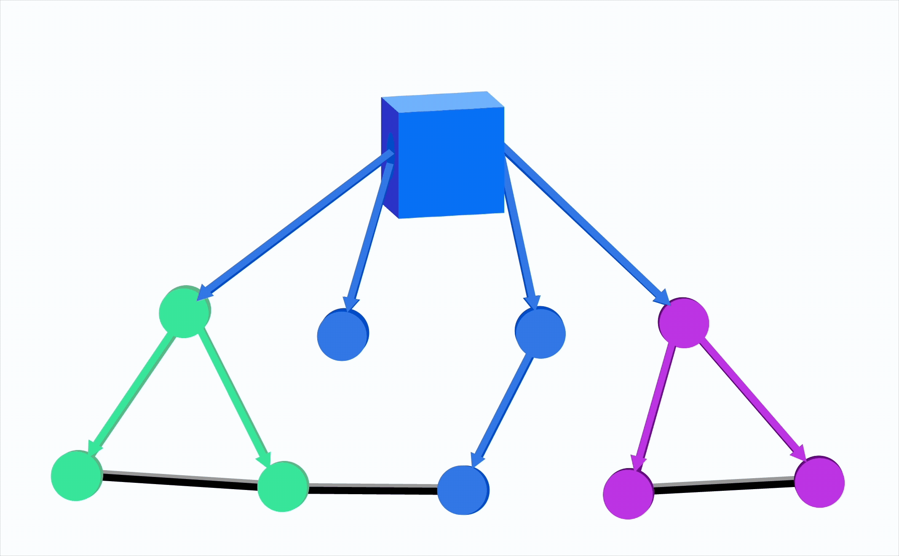

# Speckle2Graph
<!--  -->

# Purpose of the Library
This is an alpha version, so any feedback of bugs is very appreciated

The library aims to enrich the Speckle-Directed Acyclic Graph (DAG) by adding edges between BIM elements, enabling more specific graph-based analysis.

Currently we support Neo4j only

# Development Roadmap

Will be added soon!
